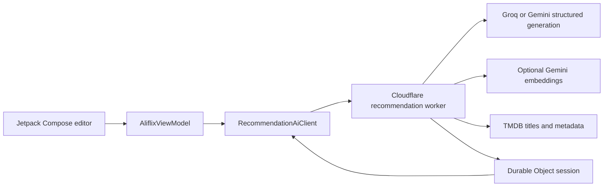

# Aliflix

[](https://github.com/alishaban144/aliflix-android/releases/latest)
[](https://github.com/alishaban144/aliflix-android/actions/workflows/mobile-release.yml)
[](#requirements)
[](https://kotlinlang.org/)

Aliflix is a native Android movie and TV discovery app built with Kotlin and Jetpack Compose. It combines a TMDB-backed catalogue, personal library features, native title details, configurable playback providers, and Ask Aliflix: a semantic recommendation experience powered by selectable Groq or Gemini interpretation and authoritative TMDB metadata.

This source tree targets **Aliflix 3.1.36** (`versionCode 126`) for Android 10 and newer.

[Download the latest mobile APK](https://github.com/alishaban144/aliflix-android/releases/latest/download/aliflix-mobile.apk) | [View release notes](https://github.com/alishaban144/aliflix-android/releases/latest)

> Aliflix does not host, upload, relay, or sell video content. Playback availability and content are controlled by the provider selected by the user.

## Highlights

- **Native mobile UI** with Home, Discover, title details, genres, and My Space.
- **No account required**; local lists, history, and settings remain fully functional offline, with optional Firebase account and cloud-sync infrastructure ready for the mobile account UI.
- **Ask Aliflix v3** with Describe, Similar, and Filters modes for movies or series.
- **Grounded recommendations**: Describe and Similar use the selected Groq or Gemini model to propose real titles, then exact TMDB identity and hydrated metadata verify every result. Both generated modes retain strict TMDB-native recovery paths when the selected provider is temporarily unavailable.
- **Deterministic filtering** after metadata enrichment, including production companies, genre inclusion/exclusion, year, runtime, language, country, rating, title exclusions, and TMDB ID exclusions.
- **Canonical Similar mode** with authoritative TMDB movie and TV title search, direct anchor identity, anchor exclusion, and preserved output type.
- **TV Networks home tab** with popularity-ranked rows for TV networks, streaming providers, and production companies.
- **Modern result cards** with match confidence, rationale, metadata, genres, TMDB rating, details navigation, and a quick My List action.
- **Real pagination** backed by signed recommendation-session cursors.
- **Personal library** with favorites, My List, recently played titles, and playback settings.
- **Native details and navigation**; a WebView is created only after Play is selected.
- **In-app updates** with APK size and SHA-256 verification before installation.
- **Android TV source flavor** with a separate application ID and D-pad-oriented UI.

## Ask Aliflix architecture



The active request path is:

```text
AskAliflixScreen
  -> AliflixViewModel.submitAskAliflix
  -> RecommendationAiClient
  -> POST /v3/recommendations
  -> recommendation-worker
```

Describe makes one compact request to the selected Groq or Gemini model and asks for a bounded premise-specific title set. The Worker exact-resolves every title through TMDB, hydrates authoritative metadata, and applies hard filters such as Returning or Ended only as eligibility checks. Relevance never receives a popularity, rating, status, generic genre, or title-word boost. If the provider has a retryable capacity, quota, timeout, or structured-output failure, Describe derives only the query's explicit concepts locally and uses exact TMDB keyword/genre retrieval with deterministic ranking; it does not make another model or embedding request and returns fewer results instead of padding.

Similar uses authoritative TMDB anchor details and a dedicated medium-effort generation contract. It supplements model candidates with the anchor's TMDB recommendations, Similar catalogue, and grounded keyword lanes; continuation pages remain available when the selected model is temporarily unavailable. Single-anchor, multi-anchor, and cross-media matches must share substantive story or narrative connections; broad genre overlap cannot pass. Filters retains its specialized deterministic TMDB retrieval path. Missing metadata cannot satisfy a filter that requires it.

## Optional account architecture

Anonymous use remains the default and never depends on Firebase. On mobile, `AccountRepository` owns Firebase Authentication and modern Credential Manager Google Sign-In, while `AccountSyncRepository` layers Cloud Firestore listeners over the existing SharedPreferences-backed stores. Local actions update immediately and Firebase failures do not block browsing, playback, lists, history, or settings.

Cloud documents are UID-scoped under `users/{uid}` with individual My List, favorite, and recent documents keyed by `Media.key`. First sign-in unions local and cloud library data, preserves the 30-item recent limit, reconciles timestamped settings, and snapshots guest and per-account local state to prevent account-switch leakage. The TV flavor intentionally exposes only no-op account infrastructure until a TV-native sign-in experience is designed.

Recommendation sessions are stored in a Cloudflare Durable Object. Subsequent pages use signed cursors tied to the request and session instead of fabricated offsets or client-side slicing.

## App sections

### Home

- Cinematic hero and native content rails.
- For You, Movies, TV, and New filters.
- Taste-based picks and recently played titles.
- Loading, empty, retry, and offline-friendly fallback states.

### Discover

- Predictive movie and TV search.
- Genre and catalogue discovery.
- Ask Aliflix entry point with native Compose animations.
- Search ranking that handles partial titles, punctuation, years, and type qualifiers.

### Ask Aliflix

- **Describe**: enter the kind of story, theme, tone, or viewing mood you want.
- **Similar**: select a canonical TMDB title and request movie or series recommendations.
- **Filters**: combine supported TMDB genres, year, runtime, language, country, and rating constraints.
- Edit filter and Similar context directly from the result bar, or start a New search while preserving the current mode and Movies/Series selection.

### Details and playback

- Native poster/backdrop, metadata, genres, ratings, cast, and related titles.
- My List and favorite actions.
- Configurable playback provider.
- Fullscreen WebView isolated to the selected playback flow.
- Exact, boundary-safe top-level host checks and blocked pop-ups/new windows.

### My Space

- Favorites and My List.
- Recently played titles.
- Playback-provider settings.
- Ask Aliflix visibility setting.
- In-app update checks.

## Requirements

### Mobile app

- Android Studio with JDK 17.
- Android SDK Platform 37.
- Android SDK Build-Tools 36.0.0 or newer.
- Android SDK Platform-Tools for `adb` installation.
- Android 10 / API 29 or newer on the device.

The project currently uses Android Gradle Plugin 9.3.0, Kotlin 2.3.21, and Gradle 9.5.0 through the checked-in wrapper.

### Recommendation worker

- Node.js 24.
- npm.
- A Cloudflare account for deployment.
- TMDB and Gemini credentials for a separately deployed worker.

Users of the published APK do not need to provide TMDB, Gemini, or Cloudflare credentials.

## Local Android setup

Clone the repository:

```powershell
git clone https://github.com/alishaban144/aliflix-android.git
cd aliflix-android
```

Copy the SDK template:

```powershell
Copy-Item local.properties.example local.properties
```

Set the Android SDK path in `local.properties`:

```properties
sdk.dir=C\:/Users/YOUR_NAME/AppData/Local/Android/Sdk
```

`local.properties`, keystores, passwords, and API credentials must not be committed.

## Build, test, and install the mobile app

Windows PowerShell:

```powershell
.\gradlew.bat testMobileDebugUnitTest
.\gradlew.bat lintMobileDebug
.\gradlew.bat assembleMobileDebug
adb install -r .\app\build\outputs\apk\mobile\debug\app-mobile-debug.apk
```

macOS or Linux:

```bash
./gradlew testMobileDebugUnitTest
./gradlew lintMobileDebug
./gradlew assembleMobileDebug
adb install -r app/build/outputs/apk/mobile/debug/app-mobile-debug.apk
```

The debug APK is written to:

```text
app/build/outputs/apk/mobile/debug/app-mobile-debug.apk
```

## Android TV flavor

The TV flavor uses application ID `com.aliflix.app.tv`, requires Android TV 11 / API 30 or newer, and can coexist with the mobile app.

```powershell
.\gradlew.bat testTvDebugUnitTest
.\gradlew.bat lintTvDebug
.\gradlew.bat assembleTvDebug
adb install -r .\app\build\outputs\apk\tv\debug\app-tv-debug.apk
```

The current GitHub release workflow publishes the **mobile APK only**. The TV flavor remains buildable from source.

## Recommendation worker development

Install dependencies and run the checks:

```powershell
cd recommendation-worker
npm ci
npm run typecheck
npm test
```

Useful commands:

```powershell
npm run types
npm run dry-run
npm run deploy
```

The worker expects these Cloudflare secrets:

- `GEMINI_API_KEY`
- `GROQ_API_KEY` (required when the Groq setting is selected)
- `TMDB_API_KEY` or `TMDB_READ_ACCESS_TOKEN`
- `CURSOR_SIGNING_SECRET`

Set them without writing secrets into the repository:

```powershell
npx wrangler secret put GEMINI_API_KEY
npx wrangler secret put GROQ_API_KEY
npx wrangler secret put TMDB_READ_ACCESS_TOKEN
npx wrangler secret put CURSOR_SIGNING_SECRET
```

Create the Groq secret without exposing it to Android or Git:

1. Sign in at [GroqCloud API Keys](https://console.groq.com/keys). Create or select a project, then choose **Create API Key**.
2. Give the key a purpose-specific name such as `aliflix-recommendations-production` and copy it once.
3. In PowerShell, run `cd recommendation-worker` and then `npx wrangler secret put GROQ_API_KEY`.
4. Paste the key only into Wrangler's hidden prompt. Do not put it in `wrangler.jsonc`, Gradle files, Android resources, or a `.env` file committed to Git.
5. Confirm only the secret name with `npx wrangler secret list`, run the checks above, then deploy the Worker before distributing the Android build.

The Groq option uses the preview `qwen/qwen3.8-27b` model with strict JSON-schema output, low hidden reasoning effort, and a 3,072-token completion ceiling. Describe and Similar each make exactly one provider call; deterministic tests mock the provider and consume no Groq tokens. A live quality check still needs one real request after the secret is installed. Because Qwen 3.8 is a preview model, re-check Groq's model/deprecation page before each release.

The worker includes:

- Zod request validation.
- TMDB request authentication, retry, timeout, and bounded-call handling.
- One-call Gemini or Groq Describe generation with a strict zero-extra-provider TMDB fallback.
- One-call Gemini or Groq Similar generation from authoritative TMDB anchors.
- Provider-aware intent interpretation; Gemini semantic embeddings remain optional for filter queries with text.
- Deterministic hard-filter enforcement.
- Deduplication and relevance ranking.
- Durable Object recommendation sessions.
- HMAC-signed pagination cursors.
- Rate limiting and structured service errors.
- Vitest coverage for ranking, filters, failures, pagination, canonical anchors, and recommendation regressions.

## Repository structure

```text
.
|-- app/                         Android mobile and TV application
|   `-- src/main/java/com/aliflix/app/
|       |-- data/                Catalogue, metadata, search, cache, and update data
|       |-- player/              Playback navigation and WebView policy
|       |-- recommendation/      Android v3 recommendation client and mapping
|       |-- ui/                  Mobile and TV Compose interfaces
|       `-- update/              Update manifest and installer flow
|-- benchmark/                   Android benchmark module
|-- recommendation-worker/      Cloudflare Worker, Durable Object, and tests
|-- .github/workflows/           CI, signed release, and worker deployment
|-- gradle/                      Gradle wrapper configuration
`-- scripts/                     Repository maintenance utilities
```

## Security and release integrity

- Global Android cleartext networking is disabled.
- Production release tasks fail when release-keystore configuration is missing; they never fall back to debug signing.
- CI validates the release keystore certificate SHA-256 before building.
- CI verifies the final APK signer certificate SHA-256 with `apksigner`.
- The update manifest records the APK URL, version, byte size, and SHA-256.
- Aliflix verifies downloaded update metadata before launching Android's installer.
- Generated dependency and Gradle-agent caches are excluded from Git.

## Publishing a mobile release

The workflow is `.github/workflows/mobile-release.yml`. It type-checks and tests the recommendation worker, deploys it when Cloudflare credentials are configured, runs Android mobile unit tests, creates a production-signed APK, verifies the APK signer, generates `update-mobile.json`, and publishes both files to a GitHub Release.

Required GitHub Actions secrets:

- `ALIFLIX_KEYSTORE_BASE64`
- `ALIFLIX_KEYSTORE_PASSWORD`
- `ALIFLIX_KEY_ALIAS`
- `ALIFLIX_KEY_PASSWORD`
- `CLOUDFLARE_API_TOKEN` for worker deployment

For a new release:

1. Increase `mobileVersionCode` and `mobileVersionName` in `app/build.gradle.kts`.
2. Update the matching release version values and release branch in `.github/workflows/mobile-release.yml`.
3. Run the Android and worker checks locally.
4. Commit and push the release source.
5. Create and push the matching version tag, such as `v3.1.15`.
6. Wait for every workflow job to pass before treating the release as published.

Published assets:

- `aliflix-mobile.apk`
- `update-mobile.json`

The app reads the latest mobile update manifest from:

```text
https://github.com/alishaban144/aliflix-android/releases/latest/download/update-mobile.json
```

## Playback boundary and content responsibility

- Aliflix provides a native catalogue and navigation experience but does not host media.
- The selected provider controls the playback page and content availability.
- Aliflix does not extract, proxy, relay, or store third-party media URLs.
- New windows and pop-ups are rejected by the app's playback policy.
- Top-level WebView navigation is restricted to the configured provider and approved playback hosts.
- Provider domains can change or become unavailable independently of this project.
- Users are responsible for complying with the laws and service terms that apply in their location.

## Current release

- Version: **3.1.36**
- Version code: **126**
- Minimum Android version: **Android 10 / API 29**
- Release page: [Aliflix 3.1.36](https://github.com/alishaban144/aliflix-android/releases/tag/v3.1.36)
- Direct APK: [aliflix-mobile.apk](https://github.com/alishaban144/aliflix-android/releases/download/v3.1.36/aliflix-mobile.apk)
